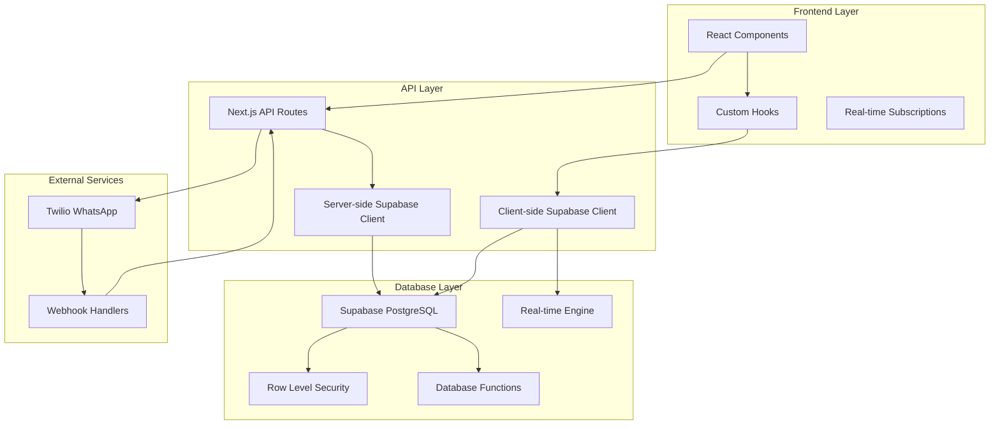

# Design Document

## Overview

This design document outlines the technical approach for conducting a comprehensive audit and improvement of the entire data persistence layer in the Employee Management System. The system currently uses Supabase as the backend with Next.js API routes and React hooks for data management. The audit will systematically examine every data flow, identify reliability issues, and implement robust solutions to ensure perfect data persistence and loading.

The architecture focuses on creating a bulletproof data layer that handles all edge cases, provides comprehensive error recovery, and maintains data integrity across all operations.

## Architecture

### Current Data Flow Analysis



### Identified Data Persistence Points

Based on the codebase analysis, the following critical data persistence points require audit:

1. **Employee Management**
   - Employee CRUD operations
   - Employee status per event
   - Work history tracking
   - Fair distribution algorithm data

2. **Event Management**
   - Event lifecycle management
   - Event-specific data isolation
   - Template system
   - Status transitions

3. **Work Area Configuration**
   - Work area CRUD operations
   - Role requirements (JSONB)
   - Capacity management
   - Assignment tracking

4. **Real-time Synchronization**
   - Supabase real-time subscriptions
   - Multi-component state sync
   - Optimistic updates
   - Conflict resolution

5. **WhatsApp Integration**
   - Message delivery tracking
   - Response processing
   - Status updates from webhooks

## Components and Interfaces

### 1. Data Persistence Audit Framework

#### Audit Test Suite Architecture

```typescript
interface DataPersistenceTest {
  testName: string
  category: 'crud' | 'realtime' | 'integrity' | 'performance'
  priority: 'critical' | 'high' | 'medium' | 'low'
  execute: () => Promise<TestResult>
  cleanup: () => Promise<void>
}

interface TestResult {
  passed: boolean
  errors: string[]
  warnings: string[]
  performance: {
    duration: number
    memoryUsage: number
  }
  dataIntegrity: {
    beforeState: any
    afterState: any
    expectedState: any
  }
}
```

#### Comprehensive Test Categories

**1. CRUD Operation Tests**
- Create operations with validation
- Read operations with filtering and sorting
- Update operations with partial data
- Delete operations with cascade effects
- Batch operations
- Transaction rollback scenarios

**2. Real-time Synchronization Tests**
- Multi-client subscription consistency
- Network interruption recovery
- Optimistic update conflicts
- Subscription cleanup
- Memory leak detection

**3. Data Integrity Tests**
- Foreign key constraint validation
- JSONB data structure validation
- Enum value enforcement
- Trigger execution verification
- Audit trail completeness

**4. Event-Specific Data Isolation Tests**
- Employee status per event separation
- Work area configuration isolation
- Cross-event data contamination prevention
- Event deletion cascade verification

### 2. Enhanced Error Handling System

#### Centralized Error Management

```typescript
interface DataError {
  code: string
  message: string
  category: 'network' | 'validation' | 'integrity' | 'permission' | 'system'
  severity: 'critical' | 'error' | 'warning' | 'info'
  context: {
    operation: string
    table: string
    recordId?: string
    userId?: string
    timestamp: string
  }
  recovery: {
    automatic: boolean
    retryable: boolean
    fallbackAction?: string
  }
}

class DataPersistenceManager {
  async executeWithRetry<T>(
    operation: () => Promise<T>,
    options: {
      maxRetries: number
      backoffMs: number
      retryCondition: (error: any) => boolean
    }
  ): Promise<T>
  
  async validateDataIntegrity(
    table: string,
    recordId: string
  ): Promise<IntegrityReport>
  
  async repairDataInconsistency(
    issue: IntegrityIssue
  ): Promise<RepairResult>
}
```

#### Recovery Mechanisms

**1. Automatic Recovery Strategies**
- Network failure retry with exponential backoff
- Optimistic update conflict resolution
- Stale data refresh triggers
- Connection restoration procedures

**2. Manual Recovery Tools**
- Data consistency checker
- Orphaned record cleanup
- Relationship repair utilities
- Backup and restore functions

### 3. Data Validation and Integrity Layer

#### Multi-Level Validation System

```typescript
interface ValidationRule {
  field: string
  type: 'required' | 'format' | 'range' | 'custom'
  validator: (value: any, context?: any) => ValidationResult
  errorMessage: string
}

interface ValidationResult {
  valid: boolean
  errors: string[]
  warnings: string[]
  sanitizedValue?: any
}

class DataValidator {
  // Client-side validation
  validateClientData(data: any, rules: ValidationRule[]): ValidationResult
  
  // Server-side validation
  validateServerData(data: any, rules: ValidationRule[]): ValidationResult
  
  // Database constraint validation
  validateDatabaseConstraints(table: string, data: any): Promise<ValidationResult>
  
  // Cross-table relationship validation
  validateRelationships(data: any, relationships: RelationshipRule[]): Promise<ValidationResult>
}
```

#### Integrity Enforcement Points

**1. Client-Side Validation**
- Form input validation
- Type checking
- Business rule enforcement
- User experience optimization

**2. API Route Validation**
- Request payload validation
- Authentication verification
- Authorization checks
- Rate limiting

**3. Database Constraint Validation**
- Foreign key constraints
- Check constraints
- Unique constraints
- Trigger-based validation

### 4. Enhanced Real-time Synchronization

#### Robust Subscription Management

```typescript
interface SubscriptionManager {
  subscriptions: Map<string, RealtimeSubscription>
  
  createSubscription(config: SubscriptionConfig): Promise<RealtimeSubscription>
  destroySubscription(id: string): Promise<void>
  reconnectAll(): Promise<void>
  healthCheck(): Promise<SubscriptionHealth[]>
}

interface SubscriptionConfig {
  table: string
  filter?: string
  event: 'INSERT' | 'UPDATE' | 'DELETE' | '*'
  onData: (payload: any) => void
  onError: (error: any) => void
  onReconnect: () => void
  retryConfig: RetryConfig
}

interface RealtimeSubscription {
  id: string
  status: 'connected' | 'disconnected' | 'reconnecting' | 'error'
  lastActivity: Date
  errorCount: number
  cleanup: () => Promise<void>
}
```

#### Conflict Resolution System

**1. Optimistic Update Handling**
- Version-based conflict detection
- Last-write-wins resolution
- User-prompted conflict resolution
- Automatic merge strategies

**2. State Synchronization**
- Multi-component state consistency
- Event-driven state updates
- Centralized state management
- Rollback mechanisms

### 5. Performance Monitoring and Optimization

#### Performance Metrics Collection

```typescript
interface PerformanceMetrics {
  operation: string
  duration: number
  memoryUsage: number
  networkLatency: number
  databaseQueryTime: number
  cacheHitRate: number
  errorRate: number
  timestamp: Date
}

class PerformanceMonitor {
  collectMetrics(operation: string): Promise<PerformanceMetrics>
  analyzeBottlenecks(): Promise<BottleneckReport>
  optimizeQueries(): Promise<OptimizationReport>
  generateReport(): Promise<PerformanceReport>
}
```

#### Optimization Strategies

**1. Database Query Optimization**
- Index analysis and optimization
- Query plan analysis
- N+1 query prevention
- Batch operation optimization

**2. Caching Strategy**
- Client-side caching
- API response caching
- Database query result caching
- Real-time data caching

**3. Network Optimization**
- Request batching
- Compression
- Connection pooling
- CDN utilization

## Data Models

### Enhanced Data Models with Validation

#### Employee Data Model

```typescript
interface Employee {
  id: string
  name: string
  user_id: string
  phone_number: string
  role: EmployeeRole
  skills: string[]
  employment_type: EmploymentType
  is_always_needed: boolean
  last_worked_date: string | null
  total_hours_worked: number
  created_at: string
  updated_at: string
  
  // Validation metadata
  _validation: {
    lastValidated: Date
    validationErrors: ValidationError[]
    integrityScore: number
  }
}

interface EmployeeEventStatus {
  id: string
  employee_id: string
  event_id: string
  status: EmployeeEventStatusEnum
  asked_at: string | null
  responded_at: string | null
  response_method: string | null
  created_at: string
  updated_at: string
  
  // Audit trail
  _audit: {
    statusHistory: StatusChange[]
    lastModifiedBy: string
    modificationReason: string
  }
}
```

#### Event Data Model with Isolation

```typescript
interface Event {
  id: string
  title: string
  location: string
  event_date: string
  start_time: string
  end_time: string | null
  description: string | null
  specialties: string | null
  hourly_rate: number
  employees_needed: number
  employees_to_ask: number
  status: EventStatus
  created_by: string | null
  created_at: string
  updated_at: string
  is_template: boolean
  template_id: string | null
  
  // Data isolation metadata
  _isolation: {
    dataVersion: number
    isolationKey: string
    relatedTables: string[]
    cleanupRequired: boolean
  }
}
```

#### Work Area Configuration Model

```typescript
interface WorkArea {
  id: string
  event_id: string
  name: string
  location: string
  description: string | null
  max_capacity: number
  current_assigned: number
  is_active: boolean
  priority: Priority
  role_requirements: Record<string, number>
  required_skills: string[]
  color_theme: string
  position_order: number
  created_at: string
  updated_at: string
  
  // Configuration validation
  _config: {
    validationRules: ValidationRule[]
    lastConfigCheck: Date
    configurationHash: string
    dependencyCheck: DependencyStatus
  }
}
```

## Error Handling

### Comprehensive Error Classification

#### Error Categories and Handling Strategies

**1. Network Errors**
- Connection timeouts
- DNS resolution failures
- SSL certificate issues
- Rate limiting responses

**Handling Strategy:**
- Exponential backoff retry
- Circuit breaker pattern
- Fallback to cached data
- User notification with retry options

**2. Validation Errors**
- Client-side validation failures
- Server-side validation failures
- Database constraint violations
- Business rule violations

**Handling Strategy:**
- Immediate user feedback
- Field-level error highlighting
- Suggestion for correction
- Prevention of invalid submissions

**3. Data Integrity Errors**
- Foreign key constraint violations
- Unique constraint violations
- Check constraint violations
- Trigger execution failures

**Handling Strategy:**
- Automatic data repair attempts
- Rollback to last known good state
- Administrator notification
- Manual intervention tools

**4. Real-time Synchronization Errors**
- Subscription connection failures
- Message delivery failures
- State synchronization conflicts
- Memory leaks in subscriptions

**Handling Strategy:**
- Automatic reconnection
- State reconciliation
- Conflict resolution dialogs
- Subscription cleanup

### Error Recovery Workflows

#### Automatic Recovery Procedures

```typescript
interface RecoveryProcedure {
  errorType: string
  priority: number
  canAutoRecover: boolean
  recoverySteps: RecoveryStep[]
  fallbackAction: string
  notificationRequired: boolean
}

interface RecoveryStep {
  action: string
  parameters: Record<string, any>
  timeout: number
  retryCount: number
  successCondition: (result: any) => boolean
}

class ErrorRecoveryManager {
  async executeRecovery(error: DataError): Promise<RecoveryResult>
  async validateRecovery(result: RecoveryResult): Promise<boolean>
  async rollbackRecovery(recoveryId: string): Promise<void>
  async notifyAdministrator(error: DataError, recovery: RecoveryResult): Promise<void>
}
```

## Testing Strategy

### Multi-Level Testing Approach

#### 1. Unit Testing for Data Operations

**Database Function Testing**
- Test all stored procedures and functions
- Validate trigger behavior
- Test constraint enforcement
- Verify audit trail generation

**API Route Testing**
- Test all CRUD operations
- Validate error handling
- Test authentication and authorization
- Verify request/response formats

**Hook Testing**
- Test state management
- Validate real-time subscriptions
- Test error handling
- Verify cleanup procedures

#### 2. Integration Testing for Data Flow

**End-to-End Data Flow Testing**
- Complete user workflows
- Cross-component data consistency
- Real-time synchronization
- Error propagation and recovery

**Event-Specific Data Isolation Testing**
- Employee status separation
- Work area configuration isolation
- Cross-event contamination prevention
- Data cleanup verification

#### 3. Performance and Load Testing

**Database Performance Testing**
- Query performance under load
- Concurrent operation handling
- Index effectiveness
- Connection pool management

**Real-time Performance Testing**
- Subscription scalability
- Message delivery latency
- Memory usage monitoring
- Connection stability

#### 4. Reliability and Stress Testing

**Failure Scenario Testing**
- Network interruption handling
- Database connection failures
- Partial data corruption
- High concurrent load

**Recovery Testing**
- Automatic recovery procedures
- Manual recovery tools
- Data consistency after recovery
- User experience during recovery

### Automated Testing Infrastructure

#### Continuous Testing Pipeline

```typescript
interface TestSuite {
  name: string
  category: TestCategory
  tests: DataPersistenceTest[]
  schedule: TestSchedule
  notifications: NotificationConfig
}

interface TestSchedule {
  frequency: 'continuous' | 'hourly' | 'daily' | 'weekly'
  conditions: string[]
  dependencies: string[]
}

class TestOrchestrator {
  async runTestSuite(suite: TestSuite): Promise<TestSuiteResult>
  async scheduleTests(suites: TestSuite[]): Promise<void>
  async generateReport(results: TestSuiteResult[]): Promise<TestReport>
  async alertOnFailures(failures: TestFailure[]): Promise<void>
}
```

## Security Considerations

### Data Security Audit

#### Access Control Validation
- Row Level Security (RLS) policy testing
- Authentication token validation
- Authorization boundary testing
- Privilege escalation prevention

#### Data Protection Measures
- Sensitive data encryption
- PII handling compliance
- Audit trail security
- Backup data protection

#### API Security Testing
- Input validation testing
- SQL injection prevention
- XSS protection
- Rate limiting effectiveness

### Security Monitoring

#### Real-time Security Monitoring
- Suspicious activity detection
- Unauthorized access attempts
- Data modification tracking
- Performance anomaly detection

## Deployment and Monitoring

### Production Deployment Strategy

#### Staged Deployment Approach
1. **Development Environment Testing**
   - Complete test suite execution
   - Performance baseline establishment
   - Security vulnerability scanning

2. **Staging Environment Validation**
   - Production-like data testing
   - Load testing
   - Integration testing
   - User acceptance testing

3. **Production Deployment**
   - Blue-green deployment
   - Gradual rollout
   - Real-time monitoring
   - Rollback procedures

### Monitoring and Alerting

#### Comprehensive Monitoring System

```typescript
interface MonitoringConfig {
  metrics: MetricConfig[]
  alerts: AlertConfig[]
  dashboards: DashboardConfig[]
  reports: ReportConfig[]
}

interface MetricConfig {
  name: string
  type: 'counter' | 'gauge' | 'histogram'
  collection: CollectionConfig
  thresholds: ThresholdConfig[]
}

class MonitoringSystem {
  async collectMetrics(): Promise<MetricData[]>
  async evaluateAlerts(): Promise<Alert[]>
  async generateDashboard(): Promise<Dashboard>
  async createReport(): Promise<MonitoringReport>
}
```

#### Key Performance Indicators (KPIs)

**Data Reliability KPIs**
- Data consistency score
- Error rate by operation type
- Recovery success rate
- Mean time to recovery (MTTR)

**Performance KPIs**
- Average response time
- Database query performance
- Real-time synchronization latency
- Memory usage trends

**User Experience KPIs**
- Data loading success rate
- UI responsiveness
- Error message clarity
- Recovery user experience