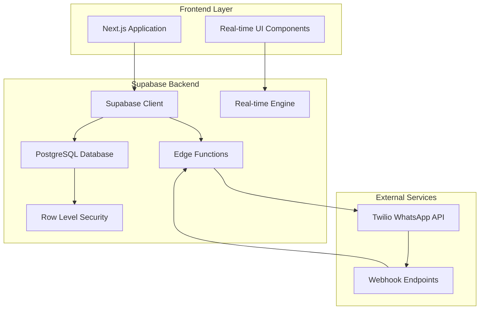

# Design Document

## Overview

This design document outlines the technical architecture for implementing a Supabase backend for the Employee Management System (EMS). The system manages the complete event-based employee scheduling lifecycle, from event creation through WhatsApp recruitment, fair work distribution, time tracking, and payroll calculation.

The architecture leverages Supabase's PostgreSQL database, real-time subscriptions, Row Level Security (RLS), and Edge Functions to create a scalable, secure, and responsive system.

## Architecture

### High-Level Architecture



### Database Architecture

The system uses a normalized PostgreSQL schema with the following core entities:

- **employees**: Core employee data with work history tracking
- **events**: Event definitions with status lifecycle
- **work_areas**: Event-specific work locations and role requirements
- **employee_event_status**: Per-event employee availability tracking
- **work_assignments**: Employee assignments to specific work areas
- **time_records**: Work session tracking with hours and payments
- **whatsapp_messages**: Message history and delivery tracking
- **audit_logs**: Complete system activity audit trail

## Components and Interfaces

### 1. Database Schema

#### Core Tables

**employees**
```sql
CREATE TABLE employees (
    id UUID PRIMARY KEY DEFAULT gen_random_uuid(),
    name VARCHAR(255) NOT NULL,
    user_id VARCHAR(100) UNIQUE NOT NULL,
    phone_number VARCHAR(20) NOT NULL,
    role employee_role NOT NULL,
    skills TEXT[],
    employment_type employment_type DEFAULT 'part_time',
    is_always_needed BOOLEAN DEFAULT false,
    last_worked_date TIMESTAMP,
    total_hours_worked DECIMAL(10,2) DEFAULT 0,
    created_at TIMESTAMP DEFAULT NOW(),
    updated_at TIMESTAMP DEFAULT NOW()
);
```

**events**
```sql
CREATE TABLE events (
    id UUID PRIMARY KEY DEFAULT gen_random_uuid(),
    title VARCHAR(255) NOT NULL,
    location VARCHAR(255) NOT NULL,
    event_date DATE NOT NULL,
    start_time TIME NOT NULL,
    end_time TIME,
    description TEXT,
    specialties TEXT,
    hourly_rate DECIMAL(8,2) NOT NULL,
    employees_needed INTEGER NOT NULL,
    employees_to_ask INTEGER NOT NULL,
    status event_status DEFAULT 'draft',
    created_by UUID REFERENCES auth.users(id),
    created_at TIMESTAMP DEFAULT NOW(),
    updated_at TIMESTAMP DEFAULT NOW()
);
```

**work_areas**
```sql
CREATE TABLE work_areas (
    id UUID PRIMARY KEY DEFAULT gen_random_uuid(),
    event_id UUID REFERENCES events(id) ON DELETE CASCADE,
    name VARCHAR(255) NOT NULL,
    location VARCHAR(255) NOT NULL,
    max_capacity INTEGER NOT NULL,
    is_active BOOLEAN DEFAULT true,
    role_requirements JSONB NOT NULL DEFAULT '{}',
    created_at TIMESTAMP DEFAULT NOW()
);
```

**employee_event_status**
```sql
CREATE TABLE employee_event_status (
    id UUID PRIMARY KEY DEFAULT gen_random_uuid(),
    employee_id UUID REFERENCES employees(id) ON DELETE CASCADE,
    event_id UUID REFERENCES events(id) ON DELETE CASCADE,
    status employee_event_status_enum NOT NULL DEFAULT 'not_asked',
    asked_at TIMESTAMP,
    responded_at TIMESTAMP,
    response_method VARCHAR(50),
    created_at TIMESTAMP DEFAULT NOW(),
    updated_at TIMESTAMP DEFAULT NOW(),
    UNIQUE(employee_id, event_id)
);
```

**time_records**
```sql
CREATE TABLE time_records (
    id UUID PRIMARY KEY DEFAULT gen_random_uuid(),
    employee_id UUID REFERENCES employees(id),
    event_id UUID REFERENCES events(id),
    work_area_id UUID REFERENCES work_areas(id),
    sign_in_time TIMESTAMP NOT NULL,
    sign_out_time TIMESTAMP,
    total_hours DECIMAL(5,2),
    hourly_rate DECIMAL(8,2) NOT NULL,
    total_payment DECIMAL(10,2),
    status time_record_status DEFAULT 'active',
    notes TEXT,
    created_at TIMESTAMP DEFAULT NOW(),
    updated_at TIMESTAMP DEFAULT NOW()
);
```

#### Enums and Types

```sql
CREATE TYPE employee_role AS ENUM ('manager', 'allrounder', 'versorger', 'verkauf', 'essen');
CREATE TYPE employment_type AS ENUM ('part_time', 'fixed');
CREATE TYPE event_status AS ENUM ('draft', 'recruiting', 'planned', 'active', 'completed', 'cancelled');
CREATE TYPE employee_event_status_enum AS ENUM ('not_asked', 'asked', 'available', 'unavailable', 'selected', 'working', 'completed');
CREATE TYPE time_record_status AS ENUM ('active', 'completed', 'cancelled');
```

### 2. Edge Functions

#### WhatsApp Integration Function

**Function: `send-whatsapp-invitation`**
```typescript
interface WhatsAppInvitationRequest {
  eventId: string;
  employeeIds: string[];
  messageTemplate?: string;
}

// Handles sending WhatsApp invitations via Twilio
// Updates employee_event_status to 'asked'
// Logs messages in whatsapp_messages table
```

**Function: `process-whatsapp-response`**
```typescript
interface WhatsAppResponse {
  from: string;
  body: string;
  messageId: string;
}

// Processes incoming WhatsApp responses
// Updates employee_event_status based on response
// Triggers additional recruitment if needed
```

#### Fair Distribution Algorithm Function

**Function: `select-employees-for-event`**
```typescript
interface EmployeeSelectionRequest {
  eventId: string;
  additionalCount?: number;
}

// Implements fair distribution algorithm
// Prioritizes employees with oldest last_worked_date
// Always includes 'always_needed' employees
// Returns list of employee IDs to ask
```

#### Event Lifecycle Management Function

**Function: `manage-event-lifecycle`**
```typescript
interface EventLifecycleRequest {
  eventId: string;
  action: 'start' | 'complete' | 'cancel';
}

// Handles automatic status transitions
// Creates time_records when event starts
// Calculates final payments when event completes
```

### 3. Real-time Subscriptions

#### Employee Status Updates
```typescript
// Real-time subscription for employee event status changes
const employeeStatusSubscription = supabase
  .channel('employee-status-changes')
  .on('postgres_changes', {
    event: '*',
    schema: 'public',
    table: 'employee_event_status'
  }, handleEmployeeStatusChange)
  .subscribe();
```

#### Event Status Updates
```typescript
// Real-time subscription for event status changes
const eventStatusSubscription = supabase
  .channel('event-status-changes')
  .on('postgres_changes', {
    event: '*',
    schema: 'public',
    table: 'events'
  }, handleEventStatusChange)
  .subscribe();
```

### 4. Row Level Security (RLS) Policies

#### Employee Data Access
```sql
-- Employees can view their own data
CREATE POLICY "employees_select_own" ON employees
  FOR SELECT USING (auth.uid()::text = user_id);

-- Managers can view all employee data
CREATE POLICY "employees_select_managers" ON employees
  FOR SELECT USING (
    EXISTS (
      SELECT 1 FROM employees 
      WHERE user_id = auth.uid()::text 
      AND role = 'manager'
    )
  );
```

#### Event Management Access
```sql
-- Only managers can create/modify events
CREATE POLICY "events_managers_only" ON events
  FOR ALL USING (
    EXISTS (
      SELECT 1 FROM employees 
      WHERE user_id = auth.uid()::text 
      AND role = 'manager'
    )
  );
```

## Data Models

### Employee Work History Tracking

The system maintains comprehensive work history through:

1. **last_worked_date**: Updated automatically when employee completes work
2. **total_hours_worked**: Cumulative hours across all events
3. **Fair Distribution Query**: Sorts employees by last_worked_date ASC for selection

### Event-Specific Status Management

Each employee maintains separate status per event:

- **not_asked**: Employee hasn't been contacted for this event
- **asked**: WhatsApp invitation sent, awaiting response
- **available**: Employee accepted invitation
- **unavailable**: Employee declined invitation
- **selected**: Employee chosen for work assignment
- **working**: Employee currently working the event
- **completed**: Employee finished work for this event

### Work Area Assignment Model

Work areas define:
- Physical location and capacity constraints
- Role requirements with quantities (JSON structure)
- Current assignments and utilization
- Integration with time tracking

## Error Handling

### Database Constraints and Validation

1. **Unique Constraints**: Prevent duplicate employee-event status records
2. **Foreign Key Constraints**: Ensure referential integrity
3. **Check Constraints**: Validate enum values and business rules
4. **Triggers**: Automatic timestamp updates and data validation

### WhatsApp Integration Error Handling

1. **Message Delivery Failures**: Retry mechanism with exponential backoff
2. **Invalid Phone Numbers**: Validation and error logging
3. **Rate Limiting**: Queue management for bulk message sending
4. **Response Processing**: Handle malformed or unexpected responses

### Real-time Synchronization Error Handling

1. **Connection Failures**: Automatic reconnection with state sync
2. **Conflict Resolution**: Optimistic locking with conflict detection
3. **Stale Data Detection**: Client-side validation and refresh prompts
4. **Network Partitions**: Offline capability with sync on reconnect

## Testing Strategy

### Unit Testing

1. **Database Functions**: Test all stored procedures and triggers
2. **Edge Functions**: Test WhatsApp integration and business logic
3. **RLS Policies**: Verify security constraints work correctly
4. **Fair Distribution Algorithm**: Test employee selection logic

### Integration Testing

1. **WhatsApp Flow**: End-to-end message sending and response processing
2. **Event Lifecycle**: Complete event creation to completion workflow
3. **Real-time Updates**: Multi-client synchronization testing
4. **Time Tracking**: Automatic sign-in/sign-out functionality

### Performance Testing

1. **Database Queries**: Optimize for large employee datasets
2. **Real-time Subscriptions**: Test with multiple concurrent connections
3. **WhatsApp Bulk Messaging**: Test rate limiting and queue management
4. **Fair Distribution**: Performance with large employee pools

### Security Testing

1. **RLS Policy Validation**: Ensure data isolation between users
2. **Authentication Testing**: Verify JWT token handling
3. **Input Validation**: Test against SQL injection and XSS
4. **API Security**: Rate limiting and abuse prevention

## Performance Considerations

### Database Optimization

1. **Indexing Strategy**:
   - Index on employee last_worked_date for fair distribution
   - Composite index on (employee_id, event_id) for status lookups
   - Index on event_date for time-based queries

2. **Query Optimization**:
   - Use materialized views for complex aggregations
   - Implement pagination for large result sets
   - Cache frequently accessed data

### Real-time Performance

1. **Subscription Management**: Limit active subscriptions per client
2. **Message Batching**: Group related updates to reduce network traffic
3. **Selective Updates**: Only broadcast relevant changes to subscribed clients

### WhatsApp Integration Performance

1. **Message Queuing**: Implement queue system for bulk messaging
2. **Rate Limiting**: Respect Twilio API limits
3. **Async Processing**: Handle responses asynchronously
4. **Retry Logic**: Exponential backoff for failed deliveries

## Security Architecture

### Authentication and Authorization

1. **Supabase Auth**: JWT-based authentication with role claims
2. **Row Level Security**: Database-level access control
3. **API Security**: Rate limiting and request validation
4. **Audit Logging**: Complete activity tracking

### Data Protection

1. **Encryption**: All data encrypted at rest and in transit
2. **PII Handling**: Secure storage of phone numbers and personal data
3. **Access Logging**: Track all data access and modifications
4. **Backup Security**: Encrypted backups with access controls

### WhatsApp Security

1. **Webhook Validation**: Verify Twilio webhook signatures
2. **Message Encryption**: End-to-end encryption for sensitive data
3. **Phone Number Validation**: Prevent unauthorized message sending
4. **Response Validation**: Sanitize and validate all incoming responses