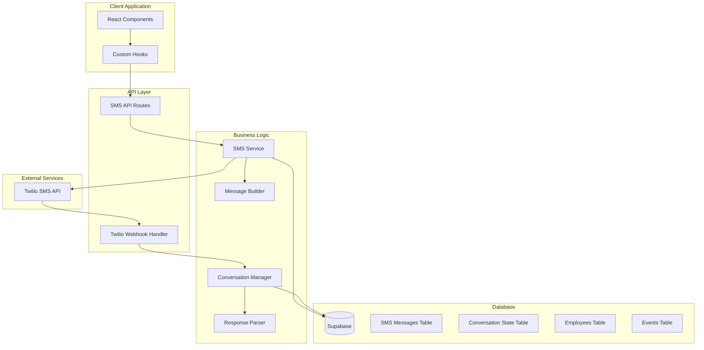

# Design Document

## Overview

The Twilio SMS Integration system extends the existing WhatsApp functionality to provide comprehensive bidirectional SMS communication between the employee management application and employees. The system handles employee self-registration, event notifications, intelligent conversation flows, and various operational scenarios through a state-machine-based approach.

The design leverages the existing Supabase database schema and Twilio infrastructure while adding new components for SMS-specific functionality, conversation state management, and intelligent response parsing.

## Architecture

### High-Level Architecture



### Component Architecture

The system follows a modular architecture with clear separation of concerns:

1. **Presentation Layer**: React components for SMS management UI
2. **API Layer**: Next.js API routes for SMS operations and webhook handling
3. **Business Logic Layer**: Core services for SMS operations, conversation management, and response parsing
4. **Data Layer**: Extended Supabase schema with SMS-specific tables
5. **External Integration**: Twilio SMS API integration

## Components and Interfaces

### 1. Database Schema Extensions

#### SMS Messages Table
```sql
CREATE TABLE sms_messages (
    id UUID PRIMARY KEY DEFAULT gen_random_uuid(),
    employee_id UUID REFERENCES employees(id),
    event_id UUID REFERENCES events(id),
    conversation_id UUID REFERENCES sms_conversations(id),
    message_sid VARCHAR(255),
    phone_number VARCHAR(20) NOT NULL,
    message_body TEXT NOT NULL,
    message_type VARCHAR(50) DEFAULT 'outbound',
    direction VARCHAR(20) NOT NULL, -- 'inbound' or 'outbound'
    delivery_status VARCHAR(50),
    sent_at TIMESTAMP DEFAULT NOW(),
    delivered_at TIMESTAMP,
    created_at TIMESTAMP DEFAULT NOW()
);
```

#### SMS Conversations Table
```sql
CREATE TABLE sms_conversations (
    id UUID PRIMARY KEY DEFAULT gen_random_uuid(),
    employee_id UUID REFERENCES employees(id),
    phone_number VARCHAR(20) NOT NULL,
    current_state VARCHAR(100) NOT NULL DEFAULT 'idle',
    context_data JSONB DEFAULT '{}',
    event_id UUID REFERENCES events(id),
    last_activity_at TIMESTAMP DEFAULT NOW(),
    expires_at TIMESTAMP,
    created_at TIMESTAMP DEFAULT NOW(),
    updated_at TIMESTAMP DEFAULT NOW()
);
```

#### Employee Registration Requests Table
```sql
CREATE TABLE employee_registration_requests (
    id UUID PRIMARY KEY DEFAULT gen_random_uuid(),
    phone_number VARCHAR(20) NOT NULL,
    registration_code VARCHAR(50) NOT NULL,
    employee_name VARCHAR(255),
    status VARCHAR(50) DEFAULT 'pending',
    completed_at TIMESTAMP,
    created_at TIMESTAMP DEFAULT NOW()
);
```

### 2. Core Services

#### SMS Service (`lib/sms-service.ts`)
```typescript
interface SMSService {
  sendMessage(params: SendSMSParams): Promise<SMSResponse>
  sendEventNotification(eventId: string, employeeIds: string[]): Promise<NotificationResult[]>
  sendRegistrationPrompt(phoneNumber: string): Promise<SMSResponse>
  sendConfirmationMessage(phoneNumber: string, message: string): Promise<SMSResponse>
  processIncomingMessage(params: IncomingMessageParams): Promise<ProcessingResult>
}

interface SendSMSParams {
  to: string
  body: string
  eventId?: string
  employeeId?: string
  conversationId?: string
}

interface SMSResponse {
  success: boolean
  messageSid?: string
  error?: string
}
```

#### Conversation Manager (`lib/conversation-manager.ts`)
```typescript
interface ConversationManager {
  getOrCreateConversation(phoneNumber: string): Promise<Conversation>
  updateConversationState(conversationId: string, newState: string, contextData?: any): Promise<void>
  processMessage(conversation: Conversation, message: string): Promise<ConversationResponse>
  cleanupExpiredConversations(): Promise<void>
}

interface Conversation {
  id: string
  employeeId?: string
  phoneNumber: string
  currentState: ConversationState
  contextData: any
  eventId?: string
  lastActivityAt: Date
  expiresAt: Date
}

type ConversationState = 
  | 'idle'
  | 'registration_code_received'
  | 'awaiting_name'
  | 'event_notification_sent'
  | 'awaiting_event_response'
  | 'schedule_modification_request'
  | 'overtime_request_sent'
  | 'information_request'
  | 'emergency_situation'
```

#### Response Parser (`lib/response-parser.ts`)
```typescript
interface ResponseParser {
  parseEventResponse(message: string): EventResponseType
  parseScheduleModification(message: string): ScheduleModificationRequest
  parseRegistrationCode(message: string): string | null
  parseEmergencyMessage(message: string): EmergencyType
  parseInformationRequest(message: string): InformationRequestType
}

type EventResponseType = 'accept' | 'decline' | 'request_time' | 'unknown'
type EmergencyType = 'late' | 'sick' | 'injury' | 'cancellation' | 'unknown'
type InformationRequestType = 'location' | 'equipment' | 'contact' | 'general' | 'unknown'
```

#### Message Builder (`lib/message-builder.ts`)
```typescript
interface MessageBuilder {
  buildEventNotification(employee: Employee, event: Event): string
  buildRegistrationPrompt(): string
  buildConfirmationMessage(type: string, details?: any): string
  buildScheduleModificationResponse(modification: ScheduleModificationRequest): string
  buildInformationResponse(requestType: InformationRequestType, context?: any): string
  buildErrorMessage(errorType: string): string
}
```

### 3. API Routes

#### SMS API Route (`app/api/sms/route.ts`)
- Handles outbound SMS sending
- Manages bulk event notifications
- Processes registration requests

#### Webhook Handler (`app/api/sms/webhook/route.ts`)
- Receives incoming SMS messages from Twilio
- Routes messages to conversation manager
- Handles message delivery status updates

### 4. React Components

#### SMS Management Dashboard (`components/sms-management.tsx`)
- Overview of SMS communications
- Bulk messaging interface
- Conversation monitoring

#### SMS Conversation View (`components/sms-conversation-view.tsx`)
- Individual conversation threads
- Message history display
- Manual response interface

#### Employee Registration Monitor (`components/employee-registration-monitor.tsx`)
- Pending registration requests
- Registration approval interface
- Registration statistics

### 5. Custom Hooks

#### useSMS (`hooks/use-sms.ts`)
```typescript
interface UseSMS {
  sendMessage: (params: SendSMSParams) => Promise<SMSResponse>
  sendEventNotifications: (eventId: string, employeeIds: string[]) => Promise<NotificationResult[]>
  getConversations: (filters?: ConversationFilters) => Promise<Conversation[]>
  getMessageHistory: (conversationId: string) => Promise<SMSMessage[]>
  loading: boolean
  error: string | null
}
```

#### useConversationState (`hooks/use-conversation-state.ts`)
```typescript
interface UseConversationState {
  conversations: Conversation[]
  activeConversations: Conversation[]
  updateConversationState: (id: string, state: ConversationState) => Promise<void>
  cleanupExpired: () => Promise<void>
  loading: boolean
}
```

## Data Models

### Extended Employee Model
```typescript
interface Employee {
  id: string
  name: string
  user_id: string
  phone_number: string
  role: EmployeeRole
  skills: string[]
  employment_type: EmploymentType
  is_always_needed: boolean
  last_worked_date?: Date
  total_hours_worked: number
  sms_enabled: boolean // New field
  preferred_communication: 'sms' | 'whatsapp' | 'both' // New field
  created_at: Date
  updated_at: Date
}
```

### SMS Message Model
```typescript
interface SMSMessage {
  id: string
  employee_id?: string
  event_id?: string
  conversation_id?: string
  message_sid?: string
  phone_number: string
  message_body: string
  message_type: string
  direction: 'inbound' | 'outbound'
  delivery_status?: string
  sent_at: Date
  delivered_at?: Date
  created_at: Date
}
```

### Conversation Model
```typescript
interface Conversation {
  id: string
  employee_id?: string
  phone_number: string
  current_state: ConversationState
  context_data: any
  event_id?: string
  last_activity_at: Date
  expires_at: Date
  created_at: Date
  updated_at: Date
}
```

## Error Handling

### Error Types
1. **Twilio API Errors**: Network failures, invalid phone numbers, rate limits
2. **Database Errors**: Connection issues, constraint violations, transaction failures
3. **Conversation Errors**: Invalid state transitions, expired conversations
4. **Parsing Errors**: Unrecognized message formats, ambiguous responses
5. **Business Logic Errors**: Invalid employee states, event conflicts

### Error Handling Strategy
```typescript
interface ErrorHandler {
  handleTwilioError(error: TwilioError): Promise<ErrorResponse>
  handleDatabaseError(error: DatabaseError): Promise<ErrorResponse>
  handleConversationError(error: ConversationError): Promise<ErrorResponse>
  handleParsingError(message: string, error: ParsingError): Promise<ErrorResponse>
}

interface ErrorResponse {
  shouldRetry: boolean
  retryAfter?: number
  fallbackAction?: string
  userMessage?: string
  logLevel: 'info' | 'warn' | 'error' | 'critical'
}
```

### Retry Logic
- Exponential backoff for Twilio API failures
- Dead letter queue for persistent failures
- Circuit breaker pattern for service degradation
- Graceful degradation to manual processing

## Testing Strategy

### Unit Testing
- SMS service functions
- Response parsing logic
- Message building utilities
- Conversation state management

### Integration Testing
- Twilio webhook processing
- Database operations
- End-to-end conversation flows
- Error handling scenarios

### End-to-End Testing
- Complete employee registration flow
- Event notification and response cycle
- Emergency situation handling
- Schedule modification requests

### Load Testing
- Bulk SMS sending performance
- Concurrent conversation handling
- Database performance under load
- Twilio rate limit handling

## Security Considerations

### Authentication and Authorization
- Webhook signature verification
- API route protection
- Employee data access controls
- Manager-only administrative functions

### Data Protection
- Phone number encryption at rest
- Message content sanitization
- PII handling compliance
- Audit trail maintenance

### Rate Limiting
- Twilio API rate limit management
- User-initiated SMS limits
- Webhook processing throttling
- Database connection pooling

## Performance Optimization

### Caching Strategy
- Conversation state caching
- Employee data caching
- Message template caching
- Response pattern caching

### Database Optimization
- Indexed queries for conversation lookup
- Partitioned tables for message history
- Archived old conversations
- Optimized bulk operations

### Scalability Considerations
- Horizontal scaling for webhook processing
- Queue-based message processing
- Database read replicas
- CDN for static message templates

## Monitoring and Observability

### Metrics
- SMS delivery rates
- Response processing times
- Conversation completion rates
- Error rates by type

### Logging
- Structured logging for all SMS operations
- Conversation state transitions
- Error tracking and alerting
- Performance monitoring

### Alerting
- Failed message delivery
- High error rates
- Conversation processing delays
- Twilio service issues

## Deployment Considerations

### Environment Configuration
- Twilio credentials management
- Webhook URL configuration
- Database connection settings
- Feature flags for gradual rollout

### Migration Strategy
- Database schema migrations
- Data migration from existing WhatsApp system
- Gradual feature enablement
- Rollback procedures

### Monitoring and Health Checks
- SMS service health endpoints
- Database connectivity checks
- Twilio service status monitoring
- Webhook processing verification